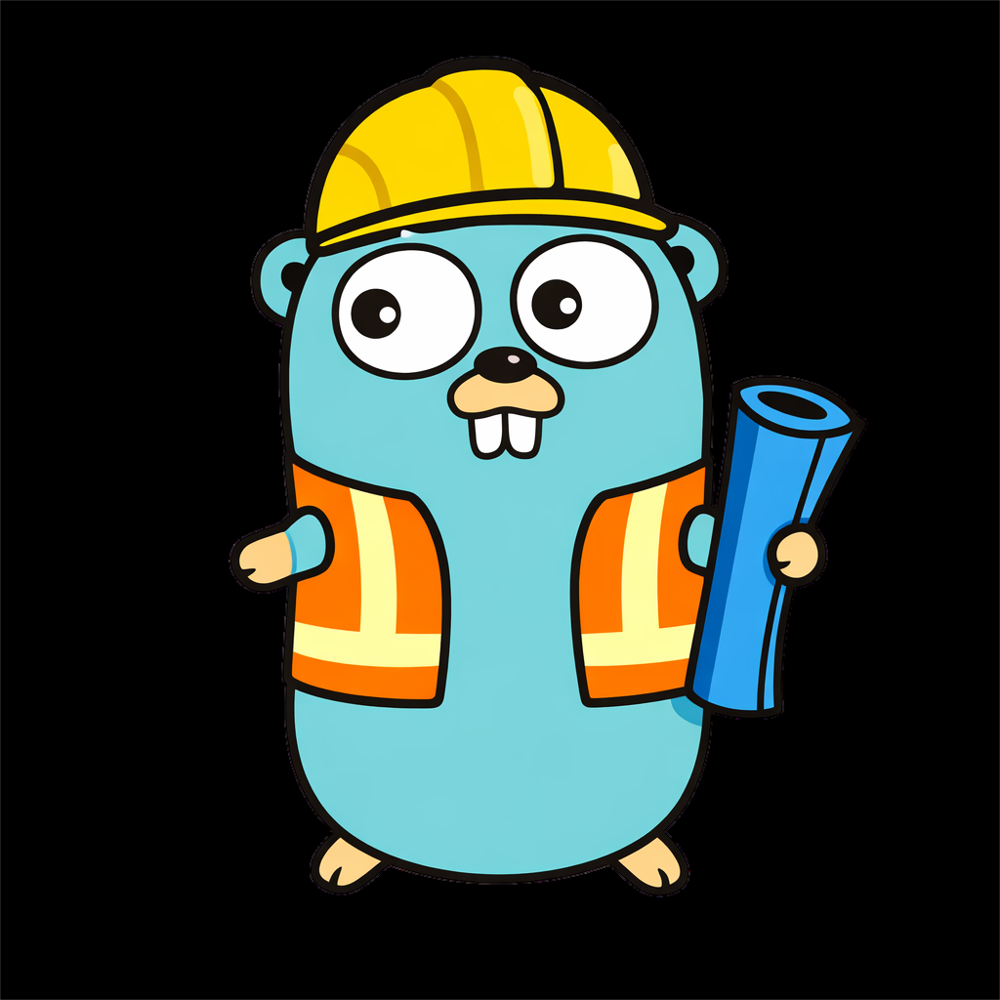

# GoBootX 🚀 

<div align="center">
  
</div>


> TUI interactiva para la creación automática de arquitecturas de desarrollo de software.


**GoBootX** es una herramienta de línea de comandos (CLI) con interfaz gráfica de terminal (TUI) diseñada para acelerar el inicio de nuevos proyectos. Permite generar automáticamente la estructura de carpetas, archivos base y configuración de Docker siguiendo patrones de diseño estándar.

## ✨ Características

- **Interfaz Interactiva**: Navegación sencilla y estilizada gracias a [Bubble Tea](https://github.com/charmbracelet/bubbletea).
- **Multi-Arquitectura**: Soporte para generar estructuras de **Clean Architecture** y **MVC**.
- **Soporte Docker**: Generación automática de `Dockerfile` optimizado según el lenguaje seleccionado.
- **Multi-Lenguaje**: Configuración adaptada para proyectos en **Go** y **Python** (FastAPI).
- **Rápido y Eficiente**: Scaffolding instantáneo para tus nuevos microservicios o aplicaciones.

## 🏗️ Arquitecturas Soportadas

### 1. Clean Architecture
Estructura robusta y escalable ideal para microservicios y aplicaciones empresariales.
- `src/domain`
- `src/use_case`
- `src/repository`
- `src/infrastructure`
- `src/api`
- `src/config`

### 2. MVC (Model-View-Controller)
Estructura clásica para aplicaciones web y prototipos rápidos.
- `src/model`
- `src/view`
- `src/controller`
- `src/config`

## 📦 Instalación

### Requisitos previos
- Go 1.18 o superior

### Opción 1: Go Install (Recomendado)

Si tienes Go instalado y configurado en tu PATH:

```bash
go install github.com/K31NER/gobootx@latest
```

### Opción 2: Compilar desde el código fuente

1. Clona el repositorio:
   ```bash
   git clone https://github.com/K31NER/gobootx.git
   cd gobootx
   ```

2. Instala las dependencias y compila:
   ```bash
   go mod tidy
   go build -o gobootx main.go
   ```

## 🚀 Uso

Navega al directorio donde quieres crear tu proyecto y ejecuta:

```bash
gobootx
```

Verás un menú interactivo donde podrás seleccionar:
1. La arquitectura deseada.
2. Si deseas incluir configuración de Docker.
3. El lenguaje del proyecto (Go o Python).

## 🛠️ Tecnologías

- **Lenguaje**: Go
- **TUI Framework**: [Bubble Tea](https://github.com/charmbracelet/bubbletea)
- **Estilos**: [Lip Gloss](https://github.com/charmbracelet/lipgloss)
